# Diagrama E-R Actualizado — Banca Personal Adaptativa

> Reemplaza al ER anterior del proyecto (que solo tenía el núcleo bancario + memoria).
> Fuente de verdad: `backend/src/BancaAdaptativa.Api/Data/AppDbContext.cs` + `Models/*.cs`.
> **19 entidades reales** en código + 1 entidad **propuesta** (`Purchase`, ADR-001/002/003, aceptada en diseño pero sin implementar).

```mermaid
erDiagram
    User {
        int IdUser PK
        string Name
        string Email UK
        string PasswordHash "nunca expuesto"
        string Locale "default es-MX"
        string Status "default active"
        datetime CreatedAt "UTC"
    }

    UserProfile {
        int IdProfile PK
        int IdUser FK, UK
        int Age
        string DisabilityType
        datetime UpdatedAt "UTC"
    }

    AccessibilityPreference {
        int IdPreference PK
        int IdUser FK, UK
        float FontScale "default 1.0"
        boolean HighContrast
        boolean DarkMode
        boolean ReducedMotion
        boolean LargeTargets
        boolean PlainLanguage
        datetime UpdatedAt "UTC"
    }

    Session {
        int IdSession PK
        int IdUser FK
        datetime StartedAt "UTC"
        datetime EndedAt_NULL "UTC, null = abierta"
        string DeviceContext
    }

    MemoryEvent {
        int IdEvent PK
        int IdSession FK
        int IdUser FK
        int IdDetectedPreference_NULL FK
        string EventType
        string Intent
        string TargetElement
        string RedactedSummary
        string SensitivityLevel "default low"
        datetime CreatedAt "UTC"
        datetime RetentionUntil_NULL "UTC"
    }

    DetectedPreference {
        int IdDetected PK
        int IdUser FK
        string PreferenceType
        string Value
        float ConfidenceScore
        int BasedOnEventsCount
        datetime UpdatedAt "UTC"
    }

    Account {
        int IdAccount PK
        int IdUser FK
        string AccountType "debito/credito"
        string Alias
        string MaskedNumber
        string Currency "default MXN"
        decimal Balance "18,2"
        string Status "default active"
        datetime CreatedAt "UTC"
    }

    Transaction {
        int IdTransaction PK
        int IdAccount FK
        date Date
        decimal Amount "18,2"
        string Direction "credit/debit"
        string Category "texto libre, legado"
        string Description
        string Status
        string Reference
        int IdExpenseCategory_NULL FK
    }

    DailyBalance {
        int IdBalance PK
        int IdAccount FK
        date Date
        decimal OpeningBalance "18,2"
        decimal Income "18,2"
        decimal Expenses "18,2"
        decimal ClosingBalance "18,2"
    }

    Transfer {
        int IdTransfer PK
        int IdUser FK
        int IdOriginAccount FK
        string DestinationAlias
        string DestinationMasked
        decimal Amount "18,2"
        string Currency "default MXN"
        string Concept
        string Status "default pending"
        string IdempotencyKey UK
        datetime ConfirmedAt_NULL "UTC"
    }

    TransferConfirmation {
        int IdConfirmation PK
        int IdTransfer FK
        string Method
        string Status "default pending"
        datetime ConfirmedAt_NULL "UTC"
    }

    ReconciliationMatch {
        int IdMatch PK
        int IdTransfer FK, UK
        int IdTransaction FK, UK
        string Status "default pending"
        float MatchScore
        datetime MatchedAt_NULL "UTC"
        string Notes
    }

    AuditLog {
        int IdLog PK
        int IdUser FK
        string Action
        string Resource
        string Result
        string RiskLevel "default low"
        string RedactedPayload
        datetime CreatedAt "UTC"
    }

    ExpenseCategory {
        int IdCategory PK
        string Name
        string Code UK
        string Icon
        boolean IsDefault
        int SortOrder
    }

    Statement {
        int IdStatement PK
        int IdAccount FK
        int CutOffDay
        date PeriodStart
        date PeriodEnd
        decimal OpeningBalance "18,2"
        decimal ClosingBalance "18,2"
        decimal TotalCredits "18,2"
        decimal TotalDebits "18,2"
        int TransactionCount
        string AccountType "debito/credito"
        string Status "default generated"
        datetime GeneratedAt "UTC"
    }

    StatementExpense {
        int IdStatementExpense PK
        int IdStatement FK
        int IdExpenseCategory FK
        decimal Amount "18,2"
        int TransactionCount
        date FirstTransactionDate_NULL
        date LastTransactionDate_NULL
    }

    Budget {
        int IdBudget PK
        int IdUser FK
        int IdExpenseCategory FK
        int Month
        int Year
        decimal AmountLimit "18,2"
        decimal CurrentSpent "18,2"
        datetime StartDate "UTC"
        datetime EndDate "UTC"
        string Status "default active"
        datetime CreatedAt "UTC"
        datetime UpdatedAt "UTC"
    }

    SavingsGoal {
        int IdGoal PK
        int IdUser FK
        string Name
        decimal TargetAmount "18,2"
        decimal CurrentAmount "18,2"
        datetime TargetDate "UTC"
        string Status "active/paused/completed"
        datetime CreatedAt "UTC"
        datetime UpdatedAt "UTC"
    }

    CreditCard {
        int IdCreditCard PK
        int IdUser FK
        string CardNumberMasked
        string CardType "Visa..."
        decimal CreditLimit "18,2"
        decimal AvailableCredit "18,2"
        float InterestRate
        int StatementCutOffDay
        int PaymentDueDay
        string Status "default active"
        datetime CreatedAt "UTC"
    }

    CreditCardStatement {
        int IdCreditCardStatement PK
        int IdCreditCard FK
        int IdStatement FK, UK
        decimal PreviousBalance "18,2"
        decimal TotalPayments "18,2"
        decimal TotalCredits "18,2"
        decimal TotalPurchases "18,2 - agregado, sera calculado (ADR-003)"
        decimal InterestCharges "18,2"
        decimal MinimumPayment "18,2"
        date PaymentDueDate
        decimal AvailableCredit "18,2"
        string Status "default generated"
        datetime GeneratedAt "UTC"
    }

    Purchase {
        int IdPurchase PK "PROPUESTO - ADR-001"
        int IdAccount_NULL FK "cascade"
        int IdCreditCard_NULL FK "cascade"
        int IdStatement_NULL FK "setnull"
        int IdTransaction_NULL FK, UK "setnull"
        string Merchant
        decimal Amount "18,2"
        date Date
        string PurchaseType "enum: fisica/en_linea/recurrente/msi - ADR-002"
        int InstallmentsTotal_NULL
        int InstallmentNumber_NULL
        string Status "default posted"
        datetime CreatedAt "UTC"
    }

    %% Relations
    User ||--o| UserProfile : "1-1 cascade"
    User ||--o| AccessibilityPreference : "1-1 cascade"
    User ||--o{ Session : "1-N cascade"
    User ||--o{ MemoryEvent : "1-N restrict"
    User ||--o{ DetectedPreference : "1-N cascade"
    User ||--o{ Account : "1-N cascade"
    User ||--o{ Transfer : "1-N cascade"
    User ||--o{ AuditLog : "1-N cascade"
    User ||--o{ Budget : "1-N cascade"
    User ||--o{ SavingsGoal : "1-N cascade"
    User ||--o{ CreditCard : "1-N cascade"

    Session ||--o{ MemoryEvent : "1-N cascade"
    DetectedPreference ||--o{ MemoryEvent : "1-N setnull"

    Account ||--o{ Transaction : "1-N cascade"
    Account ||--o{ DailyBalance : "1-N cascade"
    Account ||--o{ Transfer : "origen 1-N restrict"
    Account ||--o{ Statement : "1-N cascade"

    ExpenseCategory ||--o{ Transaction : "1-N setnull"
    ExpenseCategory ||--o{ StatementExpense : "1-N restrict"
    ExpenseCategory ||--o{ Budget : "1-N restrict"

    Statement ||--o{ StatementExpense : "1-N cascade"
    Statement ||--o| CreditCardStatement : "1-1 cascade"

    CreditCard ||--o{ CreditCardStatement : "1-N cascade"

    Transfer ||--o{ TransferConfirmation : "1-N cascade"
    Transfer ||--o| ReconciliationMatch : "1-1 cascade"
    Transaction ||--o| ReconciliationMatch : "1-1 cascade"

    Account ||--o{ Purchase : "1-N cascade (propuesto)"
    CreditCard ||--o{ Purchase : "1-N cascade (propuesto)"
    Statement ||--o{ Purchase : "line-items 1-N setnull (propuesto)"
    Transaction ||--o| Purchase : "1-1 setnull (propuesto)"
```

## Notas de esta actualización

- **Reemplaza** el ER anterior del proyecto (que tenía ~10 entidades del plan original de la demo). Este refleja el estado **real** del código en `AppDbContext.cs`/`Models/*.cs`: 19 tablas tras las migraciones `InitialCreate` + `StatementsBudgetsGoalsCards`.
- Se agregó todo el dominio de finanzas personales que no existía antes: `ExpenseCategory`, `Statement`, `StatementExpense`, `Budget`, `SavingsGoal`, `CreditCard`, `CreditCardStatement`.
- `Purchase` se incluye como **entidad propuesta** (ADR-001), marcada explícitamente en el diagrama y en sus relaciones (`propuesto`). No existe todavía en el código ni en migraciones — está en fase de diseño aceptado.
- `PurchaseType` es un **enum en código**, no una tabla catálogo (ADR-002) — por eso aparece como un campo string con la nota del enum, no como entidad aparte, a diferencia de `ExpenseCategory`.
- `CreditCardStatement.TotalPurchases` hoy es un parámetro manual; según ADR-003 pasará a calcularse (`SUM` de `Purchase` del periodo) cuando se implemente `Purchase`.
- `DeleteBehavior` real por relación (`Cascade`/`Restrict`/`SetNull`) queda anotado en cada relación — es importante conservarlo en el diagrama de clases (afecta si la asociación se dibuja como composición, agregación o asociación simple).