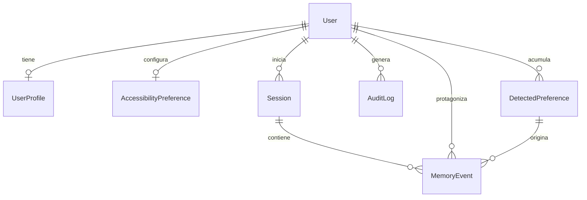
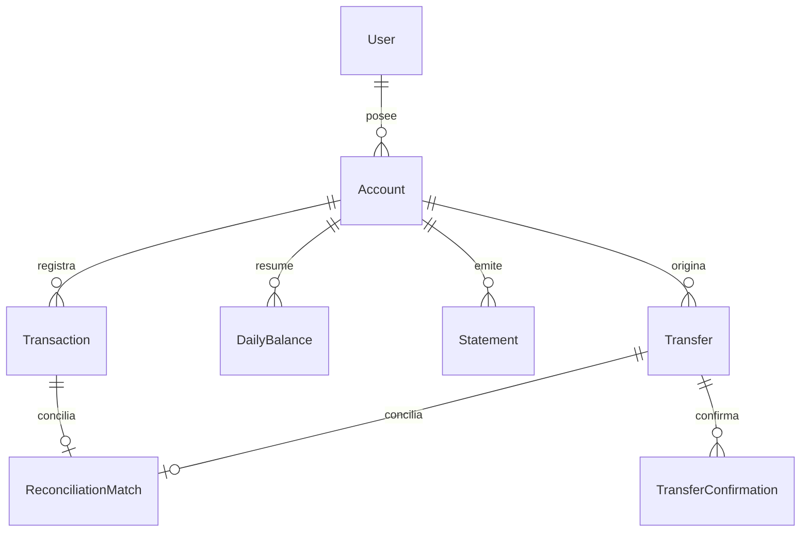
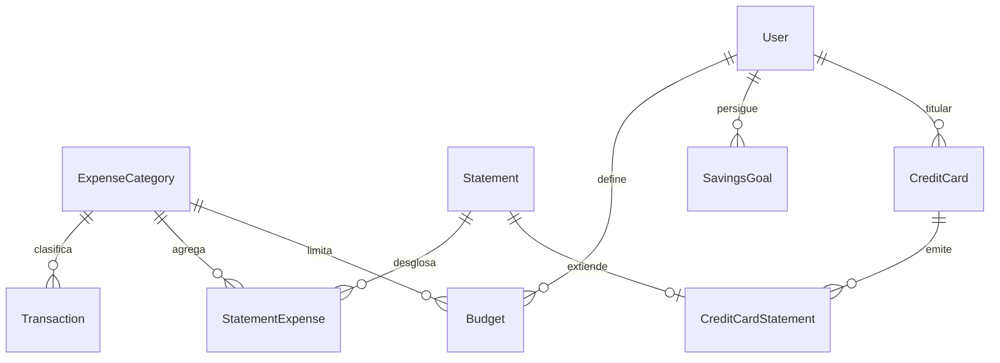
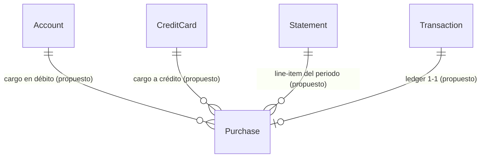

# 01 — Diagrama entidad-relación

> Fuente de verdad: `backend/src/BancaAdaptativa.Api/Data/AppDbContext.cs` + `Models/*.cs`.
> `Purchase` es **propuesta** (ver `05-brechas-compras.md`) y aparece marcada con `(propuesto)`.

## 1.1 ER completo

```mermaid
erDiagram
    User ||--o| UserProfile : "1-1 cascade"
    User ||--o| AccessibilityPreference : "1-1 cascade"
    User ||--o{ Session : "1-N cascade"
    User ||--o{ MemoryEvent : "1-N restrict"
    User ||--o{ DetectedPreference : "1-N cascade"
    User ||--o{ Account : "1-N cascade"
    User ||--o{ Transfer : "1-N cascade"
    User ||--o{ AuditLog : "1-N cascade"
    User ||--o{ Budget : "1-N cascade"
    User ||--o{ SavingsGoal : "1-N cascade"
    User ||--o{ CreditCard : "1-N cascade"

    Session ||--o{ MemoryEvent : "1-N cascade"
    DetectedPreference ||--o{ MemoryEvent : "1-N setnull"

    Account ||--o{ Transaction : "1-N cascade"
    Account ||--o{ DailyBalance : "1-N cascade"
    Account ||--o{ Transfer : "origen 1-N restrict"
    Account ||--o{ Statement : "1-N cascade"

    ExpenseCategory ||--o{ Transaction : "1-N setnull"
    ExpenseCategory ||--o{ StatementExpense : "1-N restrict"
    ExpenseCategory ||--o{ Budget : "1-N restrict"

    Statement ||--o{ StatementExpense : "1-N cascade"
    Statement ||--o| CreditCardStatement : "1-1 cascade"

    CreditCard ||--o{ CreditCardStatement : "1-N cascade"

    Budget }o--|| User : "pertenece"
    SavingsGoal }o--|| User : "pertenece"

    Transfer ||--o{ TransferConfirmation : "1-N cascade"
    Transfer ||--o| ReconciliationMatch : "1-1 cascade"
    Transaction ||--o| ReconciliationMatch : "1-1 cascade"

    Account ||--o{ Purchase : "1-N cascade (propuesto)"
    CreditCard ||--o{ Purchase : "1-N cascade (propuesto)"
    Statement ||--o{ Purchase : "line-items 1-N setnull (propuesto)"
    Transaction ||--o| Purchase : "1-1 setnull (propuesto)"

    User {
        int IdUser PK
        string Name
        string Email UK
        string PasswordHash "nunca expuesto"
        string Locale
        string Status
        datetime CreatedAt_UTC
    }
    Account {
        int IdAccount PK
        int IdUser FK
        string AccountType "debito/credito"
        string Alias
        string MaskedNumber
        string Currency
        decimal Balance
        string Status
    }
    Transaction {
        int IdTransaction PK
        int IdAccount FK
        date Date
        decimal Amount
        string Direction "credit/debit"
        string Category "texto libre"
        string Description
        string Status
        string Reference
        int IdExpenseCategory FK_NULL
    }
    Purchase {
        int IdPurchase PK "(propuesto)"
        int IdAccount FK_NULL
        int IdCreditCard FK_NULL
        int IdStatement FK_NULL
        int IdTransaction FK_NULL_UK
        string Merchant
        decimal Amount
        date Date
        string PurchaseType "enum: fisica/en_linea/recurrente/msi"
        int InstallmentsTotal_NULL
        int InstallmentNumber_NULL
        string Status
    }
    Statement {
        int IdStatement PK
        int IdAccount FK
        int CutOffDay
        date PeriodStart
        date PeriodEnd
        decimal OpeningBalance
        decimal ClosingBalance
        decimal TotalCredits
        decimal TotalDebits
        int TransactionCount
        string AccountType
        string Status
    }
    CreditCardStatement {
        int IdCreditCardStatement PK
        int IdCreditCard FK
        int IdStatement FK_UK
        decimal PreviousBalance
        decimal TotalPayments
        decimal TotalCredits
        decimal TotalPurchases "agregado, sin desglose"
        decimal InterestCharges
        decimal MinimumPayment
        date PaymentDueDate
        decimal AvailableCredit
        string Status
    }
```

## 1.2 Por dominios

### Dominio Identidad y auditoría
`User` (1) —< (1-1) `UserProfile` (edad, `DisabilityType`), (1-1) `AccessibilityPreference`
`User` (1) —< (N) `Session`, `AuditLog`. `Session` (1) —< (N) `MemoryEvent`.



### Dominio Cuentas y movimientos
`User` (1) —< (N) `Account` —< (N) `Transaction`, `DailyBalance` (único por cuenta+fecha), `Statement`.
`Transaction` —< (1-1) `ReconciliationMatch` >— (1-1) `Transfer`.



### Dominio Finanzas personales y crédito
`ExpenseCategory` (catálogo, `Code` único) —< (N) `Transaction`, `StatementExpense`, `Budget`.
`Statement` —< (N) `StatementExpense` (agregado por categoría, único por statement+categoría).
`User` —< (N) `Budget` (único por usuario+categoría+mes+año), `SavingsGoal`, `CreditCard` —< (N) `CreditCardStatement` (1-1 con `Statement`).



### Dominio Compras (propuesto)
Ver detalle en `05-brechas-compras.md`. Idea central: cada compra cuelga de la cuenta o tarjeta donde se cargó, opcionalmente del statement de su periodo y del `Transaction` que la representa en el ledger.



## 1.3 Notas de lectura

- `DeleteBehavior`: `Cascade` elimina dependientes; `Restrict` bloquea borrado con dependientes (`Transfer.OriginAccount`, `StatementExpense/Budget.ExpenseCategory`); `SetNull` libera la FK (`Transaction/MemoryEvent.DetectedPreference`, `Purchase.Statement` propuesto).
- `Transaction.Category` (string libre: `nomina`, `super`, `transporte`) ≠ `ExpenseCategory` (catálogo). La personalización debe preferir `ExpenseCategory` cuando exista y caer a `Category` si no.
- `CreditCardStatement.TotalPurchases` hoy es un número agregado mensual: **no sustituye** el desglose por compra (`Purchase`).
