# Diagrama de Clases — Modelos del Backend (Pablo)

> Namespace: `BancaAdaptativa.Api.Models`. Basado en `02-catalogo-entidades.md` y `AppDbContext.cs`.
> Convención UML usada: `*--` composición (DeleteBehavior `Cascade`), `o--` agregación (DeleteBehavior `SetNull`/`Restrict`), `-->` asociación simple de navegación.
> `Purchase` se incluye marcada como **propuesta** (ADR-001), no existe aún en código.

```mermaid
classDiagram
    class User {
        +int IdUser
        +string Name
        +string Email
        -string PasswordHash
        +string Locale
        +string Status
        +DateTime CreatedAt
    }

    class UserProfile {
        +int IdProfile
        +int IdUser
        +int Age
        +string DisabilityType
        +DateTime UpdatedAt
    }

    class AccessibilityPreference {
        +int IdPreference
        +int IdUser
        +float FontScale
        +bool HighContrast
        +bool DarkMode
        +bool ReducedMotion
        +bool LargeTargets
        +bool PlainLanguage
        +DateTime UpdatedAt
    }

    class Session {
        +int IdSession
        +int IdUser
        +DateTime StartedAt
        +DateTime? EndedAt
        +string DeviceContext
    }

    class MemoryEvent {
        +int IdEvent
        +int IdSession
        +int IdUser
        +int? IdDetectedPreference
        +string EventType
        +string Intent
        +string TargetElement
        +string RedactedSummary
        +string SensitivityLevel
        +DateTime CreatedAt
        +DateTime? RetentionUntil
    }

    class DetectedPreference {
        +int IdDetected
        +int IdUser
        +string PreferenceType
        +string Value
        +float ConfidenceScore
        +int BasedOnEventsCount
        +DateTime UpdatedAt
    }

    class Account {
        +int IdAccount
        +int IdUser
        +string AccountType
        +string Alias
        +string MaskedNumber
        +string Currency
        +decimal Balance
        +string Status
        +DateTime CreatedAt
    }

    class Transaction {
        +int IdTransaction
        +int IdAccount
        +DateOnly Date
        +decimal Amount
        +string Direction
        +string Category
        +string Description
        +string Status
        +string Reference
        +int? IdExpenseCategory
    }

    class DailyBalance {
        +int IdBalance
        +int IdAccount
        +DateOnly Date
        +decimal OpeningBalance
        +decimal Income
        +decimal Expenses
        +decimal ClosingBalance
    }

    class Transfer {
        +int IdTransfer
        +int IdUser
        +int IdOriginAccount
        +string DestinationAlias
        +string DestinationMasked
        +decimal Amount
        +string Currency
        +string Concept
        +string Status
        +string IdempotencyKey
        +DateTime? ConfirmedAt
    }

    class TransferConfirmation {
        +int IdConfirmation
        +int IdTransfer
        +string Method
        +string Status
        +DateTime? ConfirmedAt
    }

    class ReconciliationMatch {
        +int IdMatch
        +int IdTransfer
        +int IdTransaction
        +string Status
        +float MatchScore
        +DateTime? MatchedAt
        +string Notes
    }

    class AuditLog {
        +int IdLog
        +int IdUser
        +string Action
        +string Resource
        +string Result
        +string RiskLevel
        +string RedactedPayload
        +DateTime CreatedAt
    }

    class ExpenseCategory {
        +int IdCategory
        +string Name
        +string Code
        +string Icon
        +bool IsDefault
        +int SortOrder
    }

    class Statement {
        +int IdStatement
        +int IdAccount
        +int CutOffDay
        +DateOnly PeriodStart
        +DateOnly PeriodEnd
        +decimal OpeningBalance
        +decimal ClosingBalance
        +decimal TotalCredits
        +decimal TotalDebits
        +int TransactionCount
        +string AccountType
        +string Status
        +DateTime GeneratedAt
    }

    class StatementExpense {
        +int IdStatementExpense
        +int IdStatement
        +int IdExpenseCategory
        +decimal Amount
        +int TransactionCount
        +DateOnly? FirstTransactionDate
        +DateOnly? LastTransactionDate
    }

    class Budget {
        +int IdBudget
        +int IdUser
        +int IdExpenseCategory
        +int Month
        +int Year
        +decimal AmountLimit
        +decimal CurrentSpent
        +DateTime StartDate
        +DateTime EndDate
        +string Status
        +DateTime CreatedAt
        +DateTime UpdatedAt
    }

    class SavingsGoal {
        +int IdGoal
        +int IdUser
        +string Name
        +decimal TargetAmount
        +decimal CurrentAmount
        +DateTime TargetDate
        +string Status
        +DateTime CreatedAt
        +DateTime UpdatedAt
    }

    class CreditCard {
        +int IdCreditCard
        +int IdUser
        +string CardNumberMasked
        +string CardType
        +decimal CreditLimit
        +decimal AvailableCredit
        +float InterestRate
        +int StatementCutOffDay
        +int PaymentDueDay
        +string Status
        +DateTime CreatedAt
    }

    class CreditCardStatement {
        +int IdCreditCardStatement
        +int IdCreditCard
        +int IdStatement
        +decimal PreviousBalance
        +decimal TotalPayments
        +decimal TotalCredits
        +decimal TotalPurchases
        +decimal InterestCharges
        +decimal MinimumPayment
        +DateOnly PaymentDueDate
        +decimal AvailableCredit
        +string Status
        +DateTime GeneratedAt
    }

    class Purchase {
        <<propuesto_ADR_001>>
        +int IdPurchase
        +int? IdAccount
        +int? IdCreditCard
        +int? IdStatement
        +int? IdTransaction
        +string Merchant
        +decimal Amount
        +DateOnly Date
        +PurchaseType PurchaseType
        +int? InstallmentsTotal
        +int? InstallmentNumber
        +string Status
        +DateTime CreatedAt
    }

    class PurchaseType {
        <<enum_propuesto_ADR_002>> 
        Fisica
        EnLinea
        Recurrente
        Msi
    }

    %% Relations
    User "1" *-- "0..1" UserProfile : cascade
    User "1" *-- "0..1" AccessibilityPreference : cascade
    User "1" *-- "0..*" Session : cascade
    User "1" o-- "0..*" MemoryEvent : restrict
    User "1" *-- "0..*" DetectedPreference : cascade
    User "1" *-- "0..*" Account : cascade
    User "1" *-- "0..*" Transfer : cascade
    User "1" *-- "0..*" AuditLog : cascade
    User "1" *-- "0..*" Budget : cascade
    User "1" *-- "0..*" SavingsGoal : cascade
    User "1" *-- "0..*" CreditCard : cascade

    Session "1" *-- "0..*" MemoryEvent : cascade
    DetectedPreference "1" o-- "0..*" MemoryEvent : setnull

    Account "1" *-- "0..*" Transaction : cascade
    Account "1" *-- "0..*" DailyBalance : cascade
    Account "1" o-- "0..*" Transfer : origen, restrict
    Account "1" *-- "0..*" Statement : cascade

    ExpenseCategory "1" o-- "0..*" Transaction : setnull
    ExpenseCategory "1" o-- "0..*" StatementExpense : restrict
    ExpenseCategory "1" o-- "0..*" Budget : restrict

    Statement "1" *-- "0..*" StatementExpense : cascade
    Statement "1" *-- "0..1" CreditCardStatement : cascade

    CreditCard "1" *-- "0..*" CreditCardStatement : cascade

    Transfer "1" *-- "0..*" TransferConfirmation : cascade
    Transfer "1" *-- "0..1" ReconciliationMatch : cascade
    Transaction "1" *-- "0..1" ReconciliationMatch : cascade

    Account "1" o-- "0..*" Purchase : propuesto, cascade
    CreditCard "1" o-- "0..*" Purchase : propuesto, cascade
    Statement "1" o-- "0..*" Purchase : propuesto, setnull
    Transaction "1" o-- "0..1" Purchase : propuesto, setnull
    Purchase --> PurchaseType : usa
```

## Notas de diseño

- Se usa `*--` (composición) cuando el `DeleteBehavior` es `Cascade` (el hijo no tiene sentido sin el padre y se borra con él), y `o--` (agregación) cuando es `Restrict` o `SetNull` (el hijo puede sobrevivir o bloquear el borrado del padre).
- `PasswordHash` se marca `-` (privado/nunca expuesto) para recordar la regla de negocio: nunca debe salir en DTOs.
- `PurchaseType` se modela como **enum** aparte (no como entidad con tabla), siguiendo ADR-002 — a diferencia de `ExpenseCategory`, que sí es una entidad catálogo real.
- Todas las clases marcadas `<<propuesto>>` (`Purchase`, `PurchaseType`) están aceptadas en diseño pero **no implementadas en código todavía** (ADR-001/002/003). Si se prefiere, puedo generar una versión de este diagrama sin `Purchase`/`PurchaseType` que sea 100% "estado actual del código", dejando la propuesta en un diagrama aparte.
- Este diagrama cubre solo la capa de **Models** (entidades EF Core). Siguen pendientes: diagrama de clases de **Services**, y las clases de **Guillermo (MCP/IA)** y **Cain (Facade)**.